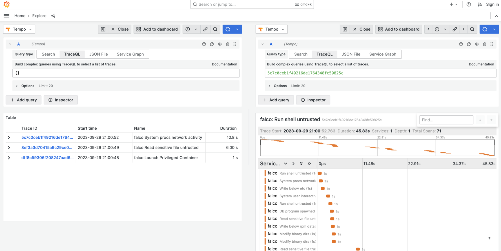

# OTEL Traces

- **Category**: Traces
- **Website**: <https://opentelemetry.io/docs/concepts/signals/traces/>

## Table of content

- [OTLP traces](#otel-traces)
  - [Table of content](#table-of-content)
  - [Configuration](#configuration)
  - [Example of config.yaml](#example-of-configyaml)
  - [Screenshots](#screenshots)

## Configuration

| Setting                       | Env var                   | Default value       | Description                                                                                                                        |
| ----------------------------- | ------------------------- | ------------------- | ---------------------------------------------------------------------------------------------------------------------------------- |
| `otlp.traces.endpoint`        | `OTLP_TRACES_ENDPOINT     |                     | OTLP endpoint in the form of http://{domain or ip}:4318/v1/traces                                                                  |
| `otlp.traces.protocol`        | `OTLP_TRACES_PROTOCOL     | `http` (from SDK)i  | OTLP Protocol                                                                                                                      |
| `otlp.traces.timeout`         | `OTLP_TRACES_TIMEOUT      | `10000` (from SDK)  | Timeout value in milliseconds                                                                                                      |
| `otlp.traces.headers`         | `OTLP_TRACES_HEADERS`     |                     | List of headers to apply to all outgoing traces in the form of "some-key=some-value,other-key=other-value"                         |
| `otlp.traces.synced`          | `OTLP_TRACES_SYNCED`      |  false              | Set to true if you want traces to be sent synchronously                                                                            |
| `otlp.traces.minimumpriority` | `OTLP_TRACES_MINIMUMPRIORITY` | `""` (=`debug`) | minimum priority of event for using this output, order is emergency|alert|critical|error|warning|notice|informational|debug        |
| `otlp.traces.checkcert`       | `OTLP_TRACES_CHECKCERT`   |  false              | Set if you want to skip TLS certificate validation                                                                                 |
| `otlp.traces.duration`        | `OTLP_TRACES_DURATION`    |  1000               | Artificial span duration in milliseconds                                                                                           |
| `otlp.traces.traceidhash`     | `OTLP_TRACES_TRACEIDHASH` |  `{{.k8s_ns_name}}{{.k8s_pod_name}}{{.container_name}}{{.container_id}}` | Trace ID Hash "seed" as gotemplate, to select fields from falcopayload output fields                                               |

> **Note**
The Env var values override the settings from yaml file.

Additionally, [standard `OTEL_` environment variables](https://opentelemetry.io/docs/specs/otel/configuration/sdk-environment-variables/) can be used:

* `OTEL_EXPORTER_OTLP_TRACES_ENDPOINT` as `OTLP_TRACES_ENDPOINT`
* `OTEL_EXPORTER_OTLP_TRACES_PROTOCOL` as `OTLP_TRACES_PROTOCOL`
* `OTEL_EXPORTER_OTLP_TRACES_HEADERS` as `OTLP_TRACES_HEADERS`
* `OTEL_EXPORTER_OTLP_TRACES_TIMEOUT` as `OTLP_TRACES_TIMEOUT`

## Example of config.yaml

```yaml
otlp:
  traces:
    # endpoint: "" # OTLP endpoint in the form of http://{domain or ip}:4318/v1/traces
    # protocol: "" # OTLP protocol: (default: "" which uses SDK default: http)
    # timeout: "" # OTLP timeout: timeout value in milliseconds (default: "" which uses SDK default: 10000)
    # headers: "" # OTLP headers: list of headers to apply to all outgoing traces in the form of "some-key=some-value,other-key=other-value" (default: "")
    # synced: false # Set to true if you want traces to be sent synchronously (default: false)
    # minimumpriority: "" # minimum priority of event for using this output, order is emergency|alert|critical|error|warning|notice|informational|debug or "" (default)
    # checkcert: true # Set if you want to skip TLS certificate validation (default: true)
    # duration: 1000 # Artificial span duration in milliseconds (default: 1000)
    # traceidhash: "" # Trace ID Hash "seed" as gotemplate, to select fields from falcopayload output fields (default: `{{.k8s_ns_name}}{{.k8s_pod_name}}{{.container_name}}{{.container_id}}` to aggregate `k8s.ns.name`, `k8s.pod.name`, `container.name`, `container.id`)
```

## Example docker-compose

At [../examples/otlp/](../examples/otlp/) you'll find an example
`docker-compose.yaml` setup to run an example OTLP traces setup.

## Screenshots

With Grafana as UI and Tempo as traces backend:


