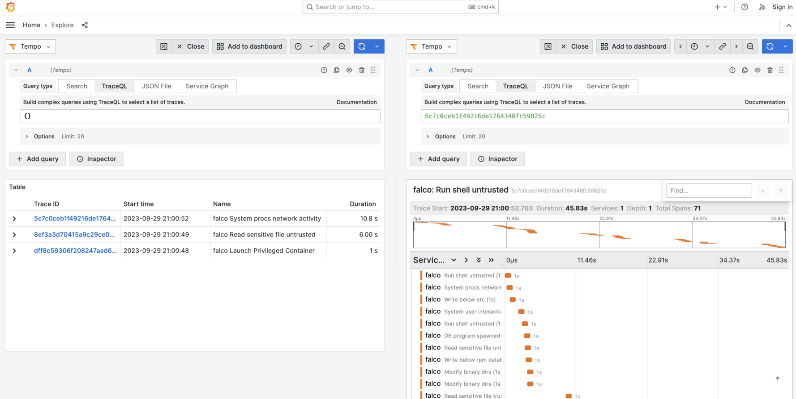

# OTEL Traces

- **Category**: Traces
- **Website**: <https://opentelemetry.io/docs/concepts/signals/traces/>

## Table of content

- [OTEL Traces](#otel-traces)
  - [Table of content](#table-of-content)
  - [Configuration](#configuration)
  - [Example of config.yaml](#example-of-configyaml)
  - [Screenshots](#screenshots)

## Configuration

|            Setting            |            Env var            |   Default value    |                                                             Description                                                             |
| ----------------------------- | ----------------------------- | ------------------ | ----------------------------------------------------------------------------------------------------------------------------------- |
| `otlp.traces.endpoint`        | `OTLP_TRACES_ENDPOINT`        |                    | OTLP endpoint in the form of http://{domain or ip}:4318/v1/traces                                                                   |
| `otlp.traces.protocol`        | `OTLP_TRACES_PROTOCOL`        | `http` (from SDK)  | OTLP Protocol                                                                                                                       |
| `otlp.traces.timeout`         | `OTLP_TRACES_TIMEOUT`         | `10000` (from SDK) | Timeout value in milliseconds                                                                                                       |
| `otlp.traces.headers`         | `OTLP_TRACES_HEADERS`         |                    | List of headers to apply to all outgoing traces in the form of "some-key=some-value,other-key=other-value"                          |
| `otlp.traces.synced`          | `OTLP_TRACES_SYNCED`          | `false`            | Set to `true` if you want traces to be sent synchronously                                                                           |
| `otlp.traces.minimumpriority` | `OTLP_TRACES_MINIMUMPRIORITY` | `""` (=`debug`)    | minimum priority of event for using this output, order is `emergency,alert,critical,error,warning,notice,informational,debug or ""` |
| `otlp.traces.checkcert`       | `OTLP_TRACES_CHECKCERT`       | `false`            | Set if you want to skip TLS certificate validation                                                                                  |
| `otlp.traces.duration`        | `OTLP_TRACES_DURATION`        | `1000`             | Artificial span duration in milliseconds (as Falco doesn't provide an ending timestamp)                                             |
| `otlp.traces.extraenvvars`    | `OTLP_TRACES_EXTRAENVVARS`    |                    | Extra env vars (override the other settings)                                                                                        |

> **Note**
For the extra Env Vars values see [standard `OTEL_*` environment variables](https://opentelemetry.io/docs/specs/otel/configuration/sdk-environment-variables/):


## Example of config.yaml

```yaml
otlp:
  traces:
    # endpoint: "" # OTLP endpoint in the form of http://{domain or ip}:4318/v1/traces
    # protocol: "" # OTLP protocol http/json, http/protobuf, grpc (default: "" which uses SDK default: http/json)
    # timeout: "" # OTLP timeout: timeout value in milliseconds (default: "" which uses SDK default: 10000)
    # headers: "" # OTLP headers: list of headers to apply to all outgoing traces in the form of "some-key=some-value,other-key=other-value" (default: "")
    # synced: false # Set to true if you want traces to be sent synchronously (default: false)
    # duration: 1000 # Artificial span duration in milliseconds (default: 1000)
    # extraenvvars: # Extra env vars (override the other settings)
      # OTEL_EXPORTER_OTLP_TRACES_TIMEOUT: 10000
      # OTEL_EXPORTER_OTLP_TIMEOUT: 10000
    # minimumpriority: "" # minimum priority of event for using this output, order is emergency|alert|critical|error|warning|notice|informational|debug or "" (default)
    # checkcert: true # Set if you want to skip TLS certificate validation (default: true)
```

## Screenshots

With Grafana as UI and Tempo as traces backend:


